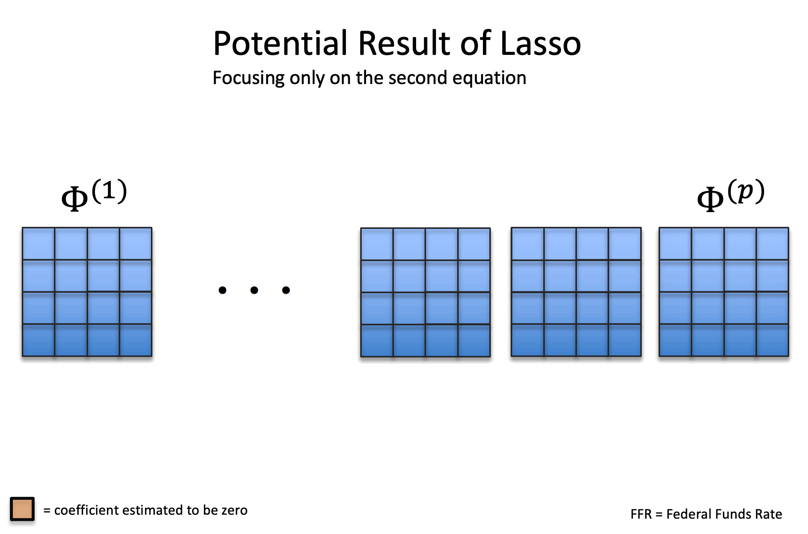

```{r setup, include=FALSE}
knitr::opts_chunk$set(echo = FALSE, 
                      dev = "tiff")
source("./helpers.R")

#rm(list = ls())
if(!require(vars)) install.packages("vars"); require(vars);
if(!require(shiny)) install.packages("shiny"); require(shiny);
if(!require(sortable)) install.packages("sortable"); require(sortable);
if(!require(tidyverse)) install.packages("tidyverse"); require(tidyverse);
if(!require(igraph)) install.packages("igraph"); require(igraph);
if(!require(bootUR)) install.packages("bootUR"); require(bootUR)

```

## Introduction

In this notebook we will introduce high dimensional techniques for Vector AutoRegressions (VARs). If you do not yet know what VARs are, you can check out [this notebook](https://github.com/enweg/SnT_VARS){target="_blank"} which introduces them in a non-technical way. For a short recap, VARs are given by the system of equations

$$
Y_t = c + \Phi^{(1)}Y_{t-1} + ... + \Phi^{(p)}Y_{t-p} + \varepsilon_t
$$

Before we can get started we need to discuss what we mean by *high dimensional*. In VARs we have two ways in which we might end up with a high dimensional setting. If the number of variables, which we will denote by $k$, or the maximum lag, which we will denote by $p$, are high, then the effective parameters that need to be estimated per equation, $p\times k$ can become very close to the number of time periods, $T$ we observe. In some circumstances, the number of effective parameters that need to be estimated per equation might even be larger than the number of time periods we observe. In either case we speak of high dimensionality. In more general, we speak of high dimensionality whenever the number of parameters to be estimated is large with respect to the number of observations.

VARs are very prone to result in high dimensional settings, which immediately follows from their construction. For every variable we include in the system, there are $k\times p$ parameters that we need to estimate - p parameters in every equation in the system. The total number of parameters to be estimated in a VAR model is thus $k^2\times p$ and hence very quickly becomes large with respect to the number of time periods observed, $T$. For example, if we have a VAR with 31 variables, as in our example, and include 5 lags of each variable, corresponding to a full trading week of lags, we already have $31^2\times 5 = 4805$ parameters to estimate. This is very large when compared to the 252 observations (one trading year).

High dimensional settings come with a special set of problems, which we will discuss in this notebook. These problems raise the need for appropriate techniques, which often are slightly different from those used in standard settings. In this notebook we will discuss how the R library *bigtime* can help overcome the high dimensional problems in VARs and how it can be used in practice. The last section will also give an example, in which we will explore the realised volatilities of 31 stock indices. 


## Why not estimate a normal VAR


Why do we not just estimate a VAR like we did in the other [notebook](https://github.com/enweg/SnT_VARS){target="_blank"}? There are multiple reasons for this. The first is that in some cases we just cannot estimate the VAR like we did previously. This happens whenever we have more parameters to estimate in one equation than we have observations. So this happens whenever $k*p > T$. The second reason involves something that is known as the *Variance-Bias trade-off*. 

What we are usually interested in is to minimise the *Mean Squared Error (MSE)* defined by 

$$
MSE = \mathbb{E}[(\hat\theta - \theta)^2] = Var(\hat\theta) + Bias(\hat\theta)^2
$$

The MSE can, however, be decomposed into two parts as shown above The first is the variance of our estimator, which roughly corresponds to the idea of how much our estimate would vary if we were to draw a sample from the population over and over again. The second part is the bias, which corresponds to the expected error our estimator makes. In many traditional settings, the goal is to set this bias to zero, corresponding to the idea, that on average one obtains the true estimate. This comes, however, often at the cost of increasing the variance of the estimator and this cost is often higher when the number of parameters to be estimated is large with respect to the number of observations. This is why, even if it is possible to estimate a VAR using traditional techniques, the results are often poor in the MSE sense when $k$ or $p$ are large with respect to the number of observations, $T$.

::: {.info}

The above representation of the MSE is only valid for scalars. In VARs we do not estimate a single parameter though. Instead we estimate the matrices $\Phi^{(j)}$ for $j = 1, ..., p$. We can summarise all these parameters in the block matrix $\Phi = [\Phi^{(1)} ... \Phi^{(p)}]$ and make a vector out of it by applying the *vec* operator (see [wikipedia](https://en.wikipedia.org/wiki/Vectorization_(mathematics)){target="_blank"}). Thus, in the VAR case, we have $\theta = vec(\Phi)$, which essentially just stacks the columns of $\Phi$ above each other. Using this parametrisation, the MSE is defined as

$$
\begin{array}{ll}
MSE &= \mathbb{E}[||\hat\theta-\theta||_2^2]\\
&=\mathbb{E}[(\hat\theta-\theta)'(\hat\theta - \theta)] \\
&= \underbrace{\mathbb{E}[(\hat\theta - \mathbb{E}\hat\theta)'(\hat\theta - \mathbb{E}\hat\theta)]}_{Variance} + \underbrace{[(\mathbb{E}\hat\theta - \theta)'(\mathbb{E}\hat\theta - \theta)]}_{\text{Bias}^2}
\end{array}
$$

:::


```{r}
apply_cube <- function(cube, f, ...){
  out <- matrix(nrow = dim(cube)[1], ncol = dim(cube)[2])
  for (i in 1:dim(cube)[1]){
    for (j in 1:dim(cube)[2]){
      arr <- cube[i, j, 1:dim(cube)[3]]
      out[i, j] <- f(arr, ...)
    }
  }
  dimnames(out) <- dimnames(cube)[1:2]
  out
}


mse_var <- readRDS("./Data/MSE_VAR_T300.RDS")
mse <- apply_cube(mse_var, mean, na.rm = TRUE)
colnames(mse) <- paste0("p_", colnames(mse))
# sd <- apply_cube(mse_var, sd, na.rm = TRUE)
df <- as_tibble(mse)
renderPlot({
  p <- df %>% 
    mutate(k = rownames(mse)) %>%
    pivot_longer(-k, names_to = "p", values_to = "MSE") %>%
    mutate(p = as.numeric(str_sub(p, 3))) %>%
    ggplot() +
    geom_point(aes(p, MSE, color = k)) +
    geom_line(aes(p, MSE, color = k)) +
    xlab("Number of Lags") +
    annotate("segment", x = 15, xend = 15.8, y = mse[4, 4], yend = mse[4, 4], 
             color = um_cols("dark-blue"), arrow = arrow(length = unit(0.1, "in"))) +
    annotate("text", x = 15, y = mse[4, 4], label = "High Dimensional Case: 256 parameters", 
             color = um_cols("dark-blue"), hjust = 1, size = 5) +
    theme_SnT() +
    annotate("segment", x = 11, xend = 10.5, y = 30, yend = 15, 
             color = um_cols("dark-blue"), arrow = arrow(length = unit(0.1, "in"))) +
    annotate("text", x = 11, y = 30, label = "Standard Cases", 
             color = um_cols("dark-blue"), hjust = 0, size = 5) +
    annotate("segment", x = 7, xend = 8, y = 30, yend = mse[4, 3], 
             color = um_cols("dark-blue"), arrow = arrow(length = unit(0.1, "in"))) +
    annotate("text", x = 7, y = 30, label = "Medium Case", 
             color = um_cols("dark-blue"), size = 5, hjust = 1) +
    labs(color = "Number of Variables", 
         title = "MSE of VAR Estimates",
         subtitle = "Simulations using T=300") +
    scale_color_um()
  # ggsave("./Figures/VARmse.png", plot = p, device = "png", width = 16, height = 6)
  p
})
```


The figure above shows this graphically. Although the MSE for the *Standard Cases* is barely distinguishable, the MSE for the *Medium* and *High Dimensional* Case is clearly larger. In the *High Dimensional* case, 256 parameters must be estimated per equation, which totals to $256\times 16=4096$ parameters for the full model. Thus, there are approximately $4096 / 300 \approx 14$ parameters per observation - clearly a very large number.

The very high MSE of the *Medium* and *High Dimensional* cases indicates that if the model was to be estimated using traditional techniques, the resulting forecasting performance will likely be poor. For this reason, more modern techniques were developed which can handle cases in which the number of parameters is high with respect to the number of observations. Most of these more modern techniques make use of *sparsity* which is discussed in the next section.


## What is sparsity and how can it be helpful?

So what is *sparsity* and why is it used by so many methods? In general, the idea behind sparsity is to put structure on the underlying data generating process (DGP). This reduces to a certain extent the freedom of the underlying DGP and thus the amount of different forms it could take. In a sparsity context, the structure we put onto the DGP is of the form that we believe that many of the parameters are actually equal to zero, or at least close to zero in the population. Thus, most variables we include in the model have either no effect at all on the outcome variable, or such a small effect that they can be largely ignored. 

These two cases are actually what distinguishes *strict sparsity* from *weak sparsity*. *Strict sparsity* corresponds to a situation in which some of the variables included in the model have a coefficient exactly equal to zero in the population, and are thus not actually affecting the outcome variable. On the other hand, *weak sparsity* only assumes that many of the parameters are small, so small that their effect on the outcome variable is negligible. 

Of course, if the sparsity assumption is not actually true, but we still enforce it, we bias our estimates, because we enforce something that is not actually the case. However, even in those scenarios in which sparsity is not really true in the population, methods that enforce it can still outperform methods that try to achieve an unbiased estimation. This comes down to the Variance-Bias trade-off explained in the previous section. Methods that enforce sparsity usually have a lower variance, because they enforce this structure. If this reduction in variance is large enough compared to the bias they introduce, then the MSE of a method that enforces sparsity will be lower than that of a method that tries to achieve an unbiased estimate. This is also the reason why methods that enforce sparsity often perform better in forecasting.


The sparsity structure that we are covering in the notebook is called the *elementwise* sparsity structure and does, next to putting structure on each parameter, also put structure on the relationship between parameters. This is slightly different to what standard sparsity patterns do. A very famous sparse method is the lasso whose sparsity pattern applied to a VAR, for example, would just enforce that some coefficients are equal to zero, without caring about whether it would make sense or not. This is depicted in the figure below.



The problem with the standard sparsity pattern enforced, for example, by lasso is that is might not make much sense to have the coefficient of a variable be zero at the first lag, but not be equal to zero at the second lag in some equation. This is because we usually think that if the twice lagged variable is important, then also the once lagged variable contains some important information. An example of this would be given by a two variable VAR of inflation and the federal funds rate. Would it truly make sense that the federal funds rate two periods ago has an effect on inflation in this period but the federal funds rate from last period not? Probably not. The federal funds rate from one period ago probably contains some information that is not included in the one from two periods ago, but might still affect inflation, maybe not as strong as the two period ago one if the inertia is very high, but it will likely contain some information. Thus, a result in which the lasso forces the first lag to be zero but the second not is often not a very useful, or at least not a very interpretable result. For these reasons, the *elementwise* sparsity pattern also enforces structure between parameters. This is depicted in the figure below.


The hirachical structure enforced by the *elementwise* sparsity pattern implies that if the coefficient of a $l$ lagged variable in equation $j$ is set to zero, then also all coefficients of that variable when lagged more than $l$ times must be zero in that equation. Thus, in the previous example, while the lasso allows for results in which the once lagged federal funds rate's coefficient is set to zero, but the twice lagged one not, the elementwise structure does not allow for such cases. In the elementwise structure, if the once lagged coefficient of the federal funds rate on inflation is set to zero, then also the coefficient of the twice lagged federal funds rate on inflation will be zero. We can, however, still obtain a result in which the twice lagged federal funds rate's coefficient is set to zero in the equation explaining inflation, but the once lagged one not. We can also still obtain a result in which the twice lagged federal fund rate's coefficient is set to zero in the equation explaining inflation, but the twice lagged inflation coefficient in the same equation is not set to zero. The elementwise structure does not impose any hierarchy across variables, nor across equations. It only enforces hierarchy among the lags of a variable in the same equation.


## How can BigTime help?

Now that we have set out what high-dimensional problems are, and have discussed what kind of sparsity structures could be used to improve upon standard techniques, it is time to discuss how *bigtime* can help. The first question we should probably settle is why we cannot just use the famous *glmnet* package. Of course, *glmnet* does support the estimation of lasso penalised regressions, and after reading the [notebook](https://github.com/enweg/SnT_VARS){target="_blank"} some might think that we can just apply this equation by equation to our VAR. This is, however, not the case. The first reasons why this is not the case is that, as we have discussed above, lasso based sparsity patterns might not be the right ones for VARs, given that some of their structure might not make sense, or at least might not be interpretable. Second, to obtain the optimal penalisation, a hyper-parameter that roughly decides how many coefficients will be set to zero, *glmnet* runs a *cross validation (CV)* procedure. The CV procedure implemented is a procedure for cross-sections though, and is not immediately applicable to time series, which we have. Hence, neither the lasso structure, not the estimation procedure in the *glmnet* package is right for VARs. 

*bigtime* is better suited for our time series setting, because it implements the *elementwise* sparsity pattern discussed above, and uses a time series cross validation procedure to find the optimal penalty parameter. *bigtime* does even more. It also helps decide on the maximum lags that should be included, and automatically decides on which penalty parameters should be tried in the time series cross validation procedure; *bigtime* therefore provides a *data driven* approach to building Vector AutoRegressive models. It is therefore a great tool for a quick first exploration of the data, but also for more detailed use cases as all of the settings are variable. 

In the example below, we will use *bigtime* to investigate the relationship between the realised volatilities of various stock indices. 
    
## Example: Realised log-Volatilities

> The data used in this example comes from the Oxford-Man library and can be found on <https://realized.oxford-man.ox.ac.uk/data/assets>[link](https://realized.oxford-man.ox.ac.uk/data/assets){target="_blank"}

**Case Description**

In the example for this notebook we are looking at realised volatilities of various stock market indices. Realised Volatilities (RVs) are basically just the summed squared returns of some asset, here the stock indices. The sum is often taken over very short intervals, such as days, hours, or even minutes. RV is extensively used in finance, because it is a good estimator of the latent volatility process underlying the stock returns. It is also of interest to investors and portfolio managers, because knowledge and estimates of the RV can help (1) form better portfolios, (2) hedge portfolios better, and (3) price options better. RV and the connectedness of realised volatilities in various markets, can also be used to gain some knowledge of the fragility of markets. If the realised volatility of markets is very dependent and connected, then shocks to one market's realised volatility can have a large impact on the realised volatility of another market, and hence diversifying by investing in various markets might not actually work that well. 

You can choose which index you would like to plot below. This can give you first hints on which indices might be connected and which ones might not. We will further investigate this question in the rest of this section.

::: {.control-full-size}

```{r}
load("./Data/rv.RData")
df.rv.raw <- scale(rv$data)
shiny::varSelectInput("plot_index", 
                      label = "Choose the Index to Plot", 
                      data = df.rv.raw, 
                      selected = ".SPX",
                      multiple = TRUE, 
                      width = "auto")
```

:::

```{r}
df.rv <- as_tibble(df.rv.raw) %>%
  mutate(Date = as.Date(rownames(as.matrix(df.rv.raw)))) %>%
  pivot_longer(-Date, names_to = "Index", values_to = "RV")

plot_rv_index <- function(index, df.rv) {
  df.rv %>%
    filter(Index %in% index) %>%
    ggplot(aes(Date, RV)) + 
    geom_line(aes(color = Index)) + 
    ylab("log of Realised Volatility") +
    scale_color_um() + 
    theme_bw() +
    theme(legend.position = "top")
}

renderPlot({
  plot_rv_index(input$plot_index, df.rv)
})

```


**Estimation using *bigtime* **

The next step in any analysis would be to build and estimate a model. We will do this using *bigtime* and more specifically using the *sparseVAR* function. This function implements both, the lasso and the *elementwise* structure above. For reasons also discussed above, we will only focus on the *elementwise* structure. Even then, *sparseVAR* still offers plenty of customisations, such as how many penalties we would like to try in the time series cross-validation procedure, whether we actually want to do time series cross-validation, and how much of the data we would like to use for estimation and how much for testing in the CV. Lastly, *sparseVAR* also offers to determine the forecasting horizon of interest. This will become important for a later section. In this section, we will not change any of the standard settings besides telling it that we want to do time series cross-validation.

Before we can use *sparseVAR*, we have to make sure that our time series are all stationary. To do so, we can use the package *bootUR* and its *order_integration* function with the argument *test = "BSQTtest"*. The results plotted below show that many of our time series are found to be integrated of order one, and are thus not actually stationary. A shortcoming of our sample is though that it is rather short and hence the unit-root tests are not very powerful. Literature in general finds that realised volatilities are stationary when longer time horizon are taken. We will thus continue without differencing but should keep in mind that we could not reject the null of a uni-root for a subset of the time series covered.

```{r}

# oi <- bootUR::BSQTtest(df.rv.raw, q = 0:10/10)
# oi <- bootUR::order_integration(df.rv.raw, test = "BSQTtest", q = 0:10/10)
# saveRDS(oi, "./Data/oi.RDS")
oi <- readRDS("./Data/oi.RDS")
renderPlot({
  bootUR::plot_order_integration(oi$order_int)
})

# df.rv.raw <- as_tibble(df.rv.raw) %>% 
#   mutate_all(.funs = function(x) x-lag(x)) %>% 
#   drop_na() %>% as.matrix() %>% scale()
```


We can estimate a model by calling `sparseVAR(Y, selection = "cv")` where `Y` is the matrix containing our data (each variable/index is one column) and `selection="cv"` tells the function that we would like to do time series cross-validation. 

```{r}
# mod <- bigtime::sparseVAR(scale(df.rv.raw), selection = "cv")
# saveRDS(mod, "./Data/rv_mod.RDS")
mod <- readRDS("./Data/rv_mod.RDS")
```


The first thing we can then do is to check how our estimated model fits the observed data. This can usually be done by plotting the fitted values, which can be obtained using `fitted(mod)` against observed values. Below is such a plot. Go trough the variables and get a first feeling for how well the model fits the observations.

::: {.control-full-size}

```{r}
shiny::varSelectInput("fittedvar", 
                      label = "Select Variable to Show", 
                      data = mod$Y, 
                      selected = ".SPX", 
                      width = "auto")
```

:::


```{r}
plot_fitted_observed <- function(mod, variable = ".SPX"){
  fit <- fitted(mod)
  Observed <- mod$Y[-(1:mod$p), variable]
  df <- cbind(Observed, fit[, variable])
  colnames(df) <- c("Observed", "Fitted")
  as_tibble(df) %>%
    mutate(Time = mod$p:(n() + mod$p - 1)) %>%
    pivot_longer(-Time, names_to = "Series", values_to = "Vals") %>%
    mutate(Series = factor(Series, levels = c("Observed", "Fitted"))) %>%
    ggplot(aes(Time, Vals)) + 
    geom_line(aes(color = Series)) + 
    ylab("") +
    theme_SnT() +
    scale_color_um()
}

renderPlot({
  variable <- as.character(input$fittedvar)
  plot_fitted_observed(mod, variable = variable)
})

```


**Checking the estimation**

Even though *bigtime* takes a lot of work from our shoulders, we should still always check the estimation results. Questions we should look into here are 

1. What was the MSFE in the CV procedure?
2. Was the MSFE very sensitive to the choice of the penalty?
3. What was the optimal penalty? 
4. How does the lag structure look like?
5. Is the resulting VAR stable?
6. How do our fitted values compare to the observed values?
7. What is the auto- and cross-correlation structure of the residuals?

We can investigate the first three of these questions by calling `plot_cv` on our model. This plots the graph below, which shows the Cross-Validation Error, the MSFE in the Cross Validation procedure, and bars spanning $\pm$ one standard error, for each lambda (the penalty parameter) that was used. The lower vertical line shows the optimal choice, while the second vertical line shows the optimal penalisation when the *one standard deviation rule* is applied (SE optimal). This rule basically states that we should take the most parsimonious (smallest) model we can, that had a MSFE at most one standard deviation higher than the optimal penalisation. 

It is important to note though, that choosing the SE optimal penalisation is often the right choice, but not always. In some circumstances, the MSFE is very volatile around the SE optimal penalisation and not very volatile around the optimal penalisation. In this case, one should consider choosing the optimal point instead of the SE optimal one. Here, this does not seem to be the case. Although the MSFE increases to the right of the SE optimal penalisation, it does not increase so abruptly that it would be reason for concern. Obviously, this is very subjective, and different parties might argue differently. One could therefore also run the analysis with both penalisations and see whether the results differ drastically.

```{r}
renderPlot({
  bigtime::plot_cv(mod)
})
```

The fourth question can be investigated by calling `lagmatrix` and setting the `returnplot` argument to `TRUE` This returns the plot that is shown below. The rows in the figure below show the responses, e.g. the equations, while the columns show the predictors. The numbers show how many non-zero coefficients of that predictor are included in each equation. Here, for example, AEX (covering the Amsterdam Exchange) contains seven non-zero coefficients of itself (AEX) and only one non-zero coefficient of BVLG (covering the Lisbon Exchange). Empty cells show cells of predictors whose coefficients were all set to zero in that equation. This could be roughly interpreted as that this predictor does not Granger-Cause the response (if you would like to brush-up on Granger Causality, check out this [notebook](https://github.com/enweg/SnT_VARS){target="_blank"}). For example, all coefficients of BVSP (covering the B3 in Brasil) are zero in the equation for AEX. This could be interpreted as that the BVSP does not Granger-Cause AEX and does therefore not contain any information about the future of the realised volatilities of the AEX (after controlling for all the other included variables at all lags). Note that the plot was obtained by using the SE optimal penalisation. We might have obtained somewhat different results - usually more non-zero lags - if we had used the optimal penalisation. 


```{r}
renderPlot({
  lagmat <- bigtime::lagmatrix(mod, returnplot = TRUE)
}, height = 600)
```

We thus far answered questions one through four. Question five is equally easy to answer by calling the `is.stable` function on the estimated model. This will check whether the resulting VAR is stable, meaning that shocks in one variable do not cause the VAR to shoot off to infinity. If we set the `verbose` argument to `TRUE`, then we even get told what the maximum eigenvalue of the companion matrix is. The output of this function is given below. The maximum eigenvalue in absolute value is less than one, and hence we are being told that the resulting VAR is stable. This is reassuring!

```{r}
bigtime::is.stable(mod, verbose = TRUE)
```

We can answer the sixth questions by calling the `diagnostic_plot` function, which gives us a plot showing the fitted values against the observed values. What we should check here is whether the fitted values represent a good fit to the data, and whether the residuals look like white noise. We will check the second of these in more detail later. Although `diagnostic_plot` gives you the plot only for one selected series, you can easily loop through them. For this interactive notebook, we only show one at a time, but you can select which series you would like to see below. In our opinion, the fitted values look reasonable, and the residuals do not look concerning. Of course, some show outliers which should probably be looked into, but for this demonstration, we will continue without further investigation into these outliers.

::: {.control-full-size}

```{r}
shiny::varSelectInput("diag_plot", 
                      "Choose an Index", 
                      data = df.rv.raw, 
                      selected = ".SPX", 
                      width = "auto")
```


:::

```{r}
renderPlot({
  variable <- as.character(input$diag_plot)
  bigtime::diagnostics_plot(mod, variable = variable, dates = as.Date(rownames(df.rv.raw)[-(1:mod$p)]))
})
```


Above we discussed the output of `diagnostic_plot` and mentioned that it can already be used to check the assumption of white noise errors. Indeed, it is important to note that although we are using a penalised VAR methodology, we are still making the assumption that errors are white noise.

We can somewhat check the white noise assumption visually by checking auto-correlation and cross-correlation plots. If you select both series below to be the same, then an auto-correlation plot will be shown. The autocorrelation plot shows the correlation between the residual now and $h$ periods ago. What we would like to see, is that none except the first bar is outside the desired confidence band. Similarly, if you select two different series below, e.g. FROM SPX (S&P500) TO AEX, then a cross-correlation plot from SPX to AEX is shown. Here, the correlation between the residual of AEX in this period and the residual of SPX $h$ periods ago is shown. If errors are white noise, then they are allowed to be correlated at the same time point, but not across time. Thus, the first bar is again allowed to fall outside the desired confidence bands, but the others should not. Play around below and check whether all these assumptions are likely to hold in this example.

```{r}
# directly taken from stats::acf implementation
calc_acf_ci <- function(acf_info, ci){
  qnorm((1 + ci)/2)/sqrt(acf_info$n.used)
}

renderPlot({
  data <- df.rv.raw

  from <- as.character(input$from.acf)
  from.index <- which(colnames(data) == from)
  to <- as.character(input$to.acf)
  to.index <- which(colnames(data) == to)
  
  max_lag <- 20
  resids <- residuals(mod)
  acf_info <- acf(resids, plot = FALSE, lag.max = max_lag)
  acf_mat <- acf_info$acf
  # acf_info$lag
  # dim(acf_mat)
  ci_99 <- calc_acf_ci(acf_info, 0.99)
  ci_95 <- calc_acf_ci(acf_info, 0.95)
  ci_80 <- calc_acf_ci(acf_info, 0.8)
  ci_60 <- calc_acf_ci(acf_info, 0.6)
  
  acf_from_to <- acf_mat[,to.index,from.index]
  df <- cbind(0:max_lag, acf_from_to)
  colnames(df) <- c("Lag", "ACF")
  df <- cbind(df, ci_99, ci_95, ci_80, ci_60)


  if (from == to){
    title <- paste("Residual Autocorrelation of", from)
  }else{
    title <- paste("Residual Crosscorrelation from", from, "to", to)
  }

  as_tibble(df) %>%
    pivot_longer(-c(Lag, ACF),
                 names_to = c(".value", "CL"),
                 names_sep = "_") %>%
    mutate(CL = factor(CL, levels = sort(unique(CL), decreasing = TRUE))) %>%
    ggplot() +
    geom_ribbon(aes(x = Lag, ymin = -ci, ymax = ci, alpha = CL),
                fill = um_cols("light-blue")) +
    geom_linerange(aes(Lag, ymin = 0, ymax = ACF), size = 1) +
    geom_hline(yintercept = 0, color = um_cols("dark-blue")) +
    labs(title = title) +
    theme_SnT()
})

```


:::{.control-full-size}

```{r}
renderUI({
  data <- df.rv.raw
  shiny::varSelectInput("from.acf", label = "From             ", data = data, 
                      selected = ".SPX", width = "15ch")
})
renderUI({
  data <- df.rv.raw
  shiny::varSelectInput("to.acf", label = "To               ", data = data, 
                      selected = ".SPX", width = "15ch")
})
```

:::


**Interpreting Results**

Now that we have checked all the assumptions, we can come to the interpretation of our results. Given that our model consists of 31 equations, it is rather infeasible to check each equation in turn. Instead, we will take a more general perspective, and will consider a network of equations. More precisely, we can consider the output of sparseVAR when using the elementwise sparsity pattern roughly as a Granger-causal analysis. Variables for which all coefficients are set equal to zero in some equation, roughly speaking, do not Granger-cause the response variable of that equation. This form of interpretation allows us to form a network in which each node represents a variable in the model. Directed arcs represent links between variables. An arc going from variable $i$ to variable $j$ means that not all coefficients of variable $i$ were set to zero in the equation for variable $j$. Thus, variable $i$ might Granger-cause variable $j$. The thickness, or in this case the opacity, of arcs usually represents how many non-zero coefficients variable $i$ has in equation $j$. 

As we increase the sparsity (increase the penalisation), more and more arcs will drop out and our network will consist more and more of only strongly linked variables. This is shown below. As you move from a dense estimation (very small penalisation) to a more and more sparse estimation (penalisation becomes larger and larger) more and more arcs drop out. Doing so, we find that the strongest links seem to exist from the US markets to European and Asian markets, and less so the other way around. Information about the realised volatility in US markets therefore seems to be invaluable for the prediction of realised volatility in the European and Asian markets. 


```{r}
# index.latlong <- list(
#   .AEX = c(52.370216, 4.895168),
#   .AORD = c(-33.868820, 151.209290),
#   .BFX = c(50.850346, 4.351721),
#   .BSESN = c(19.075983, 72.877655),
#   .BVLG = c(38.722252, -9.139337),
#   .BVSP = c(40.741895,-73.989308),
#   .DJI = c(40.7127281,-74.0060152), 
#   .FCHI = c(48.8566969,2.3514616), 
#   .FTMIB = c(45.4668,9.1905), 
#   .FTSE = c(51.5073219,-0.1276474), 
#   .GDAXI = c(50.1106444,8.6820917), 
#   .GSPTSE = c(43.6534817,-79.3839347), 
#   .HSI = c(22.2793278,114.1628131), 
#   .IBEX = c(40.4167047,-3.7035825), 
#   .IXIC = c(40.7127281,-74.0060152), 
#   .KS11 = c(37.5666791,126.9782914), 
#   .KSE = c(24.8546842,67.0207055), 
#   .MXX = c(19.4326296,-99.1331785), 
#   .N225 = c(35.6828387,139.7594549), 
#   .NSEI = c(19.0759899,72.8773928), 
#   .OMXC20 = c(55.6867243,12.5700724), 
#   .OMXHPI = c(60.1674881,24.9427473), 
#   .OMXSPI = c(59.3251172,18.0710935), 
#   .OSEAX = c(59.9133301,10.7389701), 
#   .RUT = c(40.7127281,-74.0060152), 
#   .SMSI = c(40.4167047,-3.7035825), 
#   .SPX = c(40.7127281,-74.0060152), 
#   .SSEC = c(31.2322758,121.4692071), 
#   .SSMI = c(47.3744489,8.5410422), 
#   .STI = c(1.357107,103.8194992), 
#   .STOXX50E = c(50.1106444,8.6820917)
# )
# 
# mod <- bigtime::sparseVAR(scale(df.rv.raw), selection = "none", VARgran = c(100, 50))
# data.sets <- NULL
# for (i in 1:length(mod$lambdas)){
#   lmbda <- mod$lambdas[[i]]
#   mod_tmp <- mod
#   mod_tmp$phi0hat <- mod$phi0hat[, , i]
#   mod_tmp$Phihat <- mod$Phihat[, , i]
#   mod_tmp$selection <- "tmp"
#   lagmat <- bigtime::lagmatrix(mod_tmp, returnplot = FALSE)$LPhi
#   # dimnames(lagmat) <- list(Response = colnames(data), 
#   #                        Cause = colnames(data))
#   laglinks <- 1*(lagmat > 0)
#   diag(laglinks) <- 0
#   linked <- which(laglinks == 1)
#   if (length(linked) == 0) next
#   linked.from <- ceiling(linked/dim(laglinks)[[1]])
#   linked.to <- linked%%dim(laglinks)[[1]]
#   linked.to[linked.to == 0] <- dim(laglinks)[[1]]
#   df.links <- data.frame(source = colnames(mod$Y)[linked.from], 
#                          target = colnames(mod$Y)[linked.to],
#                          importance = lagmat[linked])
#   latlong.source <- do.call(rbind, index.latlong[df.links$source])
#   colnames(latlong.source) <- c("Source_lat", "Source_long")
#   latlong.target <- do.call(rbind, index.latlong[df.links$target])
#   colnames(latlong.target) <- c("Target_lat", "Target_long")
#   df <- cbind(df.links, latlong.source, latlong.target)
#   # Some are linked to the same city. Lets delete those
#   circle <- which(df$Source_lat == df$Target_lat)
#   df <- df[-circle, ]
#   df <- as_tibble(df) %>%
#     arrange(importance) %>%
#     mutate(lambda = lmbda)
#   if (is.null(data.sets)) data.sets <- df
#   else data.sets <- rbind(data.sets, df)
#   print(paste("Working: ", round((i)/length(mod$lambdas), 2), "%"))
# }
# saveRDS(data.sets, "./Data/network_data.RDS")

```


```{r}
network.df <- readRDS("./Data/network_data.RDS")
lambdas <- sort(unique(network.df$lambda))
plot.network <- function(network.df, lmbda){
  df <- network.df %>% 
    filter(lambda == lmbda) %>%
    arrange(importance)
  world <- map_data("world")
  ggplot(world, aes(x = long, y = lat, group = group)) +
    geom_polygon(fill = "grey90") +
    coord_quickmap() +
    geom_curve(data = df, 
               aes(x = Source_long, y = Source_lat, 
                   xend = Target_long, yend = Target_lat, 
                   color = importance, group = source),
               arrow = arrow(length = unit(0.1, "inches")),
               size = 0.75, alpha = 0.7, curvature = 0.33) +
    geom_point(data = df, aes(x = Source_long, y = Source_lat, group = NULL), 
               color = "navy", size = 0.1) +
    scale_color_gradient(low = "aliceblue", high = "navy") +
    theme_classic() +
    labs(color = "Maximum Lag") +
    theme(axis.line = element_blank(),
          axis.ticks = element_blank(),
          axis.text = element_blank(), 
          axis.title = element_blank(), 
          legend.position = "right")
}


renderPlot({
  lmbda <- lambdas[[input$network.lmbda]]
  plot.network(network.df, lmbda)
})

```


:::{.control-full-size}

```{r}
sliderInput("network.lmbda", 
            label = HTML("<-- Dens<span style='margin-right: 14ch'></span>Sparse -->"),
            min = 1,
            max = length(unique(network.df$lambda)),
            value = 1, 
            step = 1, 
            ticks = FALSE, 
            width = "30ch",
            animate = animationOptions(interval = 300, loop = TRUE))
```

:::


## Forecasting

```{r}
# horizon <- 5 # one day to a full trading week
# end <- nrow(df.rv.raw)
# fcst_dat <- list()
# 
# for (h in 1:horizon){
#   est_data <- df.rv.raw[-((end-h):end), ]
#   left_out <- df.rv.raw[(end-h):end, ]
# 
# 
#   mod <- bigtime::sparseVAR(est_data, selection = "cv")
#   rec_fcst <- bigtime::recursiveforecast(mod, h = h)$fcst
#   dir_fcst <- matrix(nrow = h, ncol = ncol(est_data))
#   dir_fcst[1, ] <- bigtime::directforecast(mod, h = 1)
#   if (h > 1){
#     for (hh in 2:h){
#       mod <- bigtime::sparseVAR(est_data, selection = "cv", h = hh)
#       dir_fcst[hh, ] <- bigtime::directforecast(mod, h = hh)
#     }
#   }
# 
#   colnames(rec_fcst) <- paste0(colnames(est_data), "_", "rec.fcst")
#   colnames(dir_fcst) <- paste0(colnames(est_data), "_", "dir.fcst")
#   dat <- as_tibble(cbind(rec_fcst, dir_fcst)) %>%
#     mutate(h = 1:h)
#   fcst_dat[[h]] <- dat
#   cat("Done ", h, " ", " / ", horizon, "\r")
# }
# cat("\n")
# 
# fcst_dat
# saveRDS(fcst_dat, "./Data/fcst_dat.RDS")


fcst_dat <- readRDS("./Data/fcst_dat.RDS")

plot_fcst <- function(horizon, variable, plot_last = 50){
  end <- nrow(df.rv.raw)
  dat <- fcst_dat[[horizon]] %>%
    pivot_longer(-h, names_to = c("Index", ".value"), names_sep = "_") %>%
    filter(Index == !!variable)
  dates <- as.Date(rownames(as.matrix(df.rv.raw)))
  dat <- dat %>%
    mutate(Date = dates[(end-horizon+1):end])
  
  ob_data <- as_tibble(df.rv.raw) %>% 
    mutate(Date = dates) %>%
    dplyr::select(c(Date, !!variable)) %>%
    pivot_longer(-Date, names_to = "Index", values_to = "RV")
  
  ob_data <- ob_data[(end-plot_last+1):end, ]
  
  cols <- c(
    `Observed` = um_cols("dark-blue")[[1]], 
    `Recursive Forecast` = um_cols("red")[[1]],
    `Direct Forecast` = um_cols("light-blue")[[1]]
  )
  
  ob_data %>%
    ggplot() +
    geom_line(aes(Date, RV, color = "Observed")) +
    geom_point(aes(Date, RV, color = "Observed")) +
    geom_line(data = dat, aes(Date, rec.fcst, color = "Recursive Forecast")) +
    geom_point(data = dat, aes(Date, rec.fcst, color = "Recursive Forecast")) +
    geom_line(data = dat, aes(Date, dir.fcst, color = "Direct Forecast")) +
    geom_point(data = dat, aes(Date, dir.fcst, color = "Direct Forecast")) +
    labs(
      title = paste0("Recursive and Direct Forecasts for ", variable),
      caption = paste0("Only last ", plot_last, " observations are shown."),
      color = ""
      ) +
    ylab("log Realised Volatility") +
    theme_SnT() +
    scale_color_manual(values = cols, breaks = c("Observed", "Recursive Forecast", "Direct Forecast"))
}

```


We can also use *sparseVAR* to forecast the realised volatility. This can be done either in a recursive manner, by estimating a standard VAR model and recursively forecasting the next observation, or through direct forecasts. In the latter case, we need to estimate a new model for each horizon that we wish to forecast. Thus, if we would like to forecast the next three trading days, we need to estimate a model that predicts the next day, a model that predicts two days into the future, and a model that predicts three days into the future. This can be done by setting the $h$ parameter in the *sparseVAR* function to the desired horizon. Although direct forecasting might sound like a lot of additional work, it is the better choice when the estimated VAR is unstable. For a detailed description of recusive and direct forecasting, please check the other [notebook](https://github.com/enweg/SnT_VARS){target="_blank"}. 


```{r}
renderPlot({
  horizon <- input$fcst_horizon
  variable <- as.character(input$fcst_variable)
  plot_fcst(horizon, variable)
})
```


::: {.control-full-size}

```{r}
shiny::varSelectInput("fcst_variable", 
                      "Index", 
                      data = df.rv.raw, 
                      selected = ".SPX", 
                      width = "15ch")
shiny::sliderInput("fcst_horizon", 
                   "Forecast Horizon", 
                   min = 1, 
                   max = 5, 
                   value = 3, 
                   step = 1, 
                   ticks = FALSE, 
                   width = "auto")
```


:::

Above, we show both methods for various forecasting horizons. The recursive forecasts were obtained using the *recursiveforecast* function, and the direct forecasts were obtained using the *directforecast* function. At horizon one, both forecasts are the same, and only one will be visible. Only from horizon two onward can differences emerge. Note that the recursive forecasts tend to converge towards a straight line, while this is not always true for the direct forecasts. 

## Summary

* VAR models often suffer from high dimensionality, because the total number of parameters is equal to $k^2\times p$
* Putting structure onto the DGP by emposing sparsity is one way to overcome high-dimensional problems
* Although this introduces a bias into the estimation, the Variance-Bias trade-off tells us that if the increase in bias is small compared to the decrease in variance, high-dimensional methods can outperform traditional methods in the MSE sense
* *glmnet* cannot be used for the estimation of sparse VAR models because
    1. The sparsity pattern corresponding to the lasso is usually not sensible. A more hirachical structure is needed, such as the one enforced by the *elementwise* sparsity structure
    2. The cross-validation procedure used in *glmnet* is not appropriate for time series
* *bigtime* can be directly used to estimate sparse VAR models through the *sparseVAR* function
* It is always good to investigate the following questions after estimating a model using *sparseVAR*
    1. What was the MSFE in the CV procedure? --> use *plot_cv*
    2. Was the MSFE very sensitive to the choice of the penalty? --> use *plot_cv*
    3. What was the optimal penalty? --> use *plot_cv*
    4. How does the lag structure look like? --> use *lagmatrix* with *returnplot=TRUE*
    5. Is the resulting VAR stable? --> use *is.stable*
    6. How do our fitted values compare to the observed values? --> use *diagnostics_plot*
    7. What is the auto- and cross-correlation structure of the residuals? --> use the standard *acf* function
* After checking all the questions above, the model can be interpreted by plotting a network in which nodes correspond to variables and directed arcs correspond to a connection (non-zero coefficients).
* If all coefficients of a variable are set to zero in an equation, then we can interpret this as that this variable does not Granger-cause the response of that equation. 
* Forecasts can be obtained using *recursiveforecast* or *directforecast*, the latter of which is recommended if the estimated VAR is unstable.

