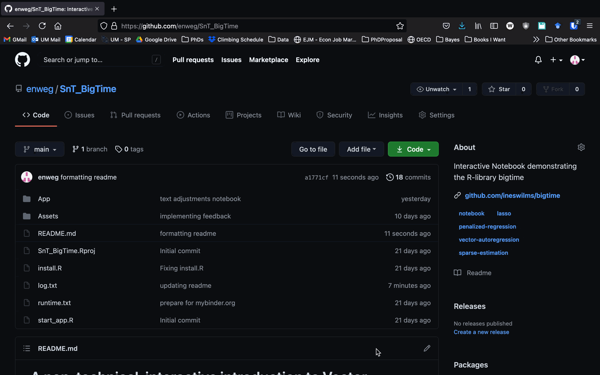
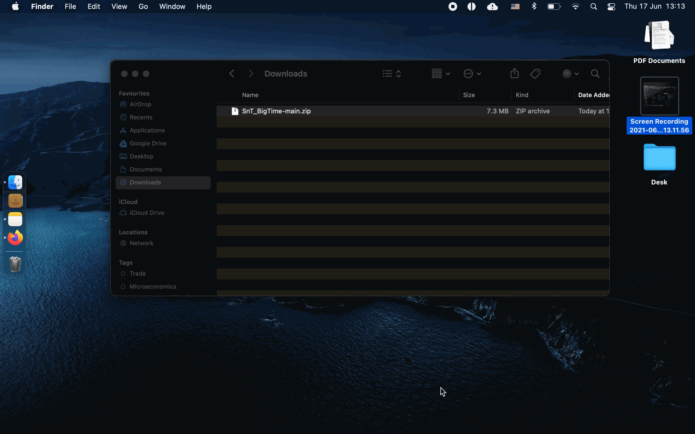
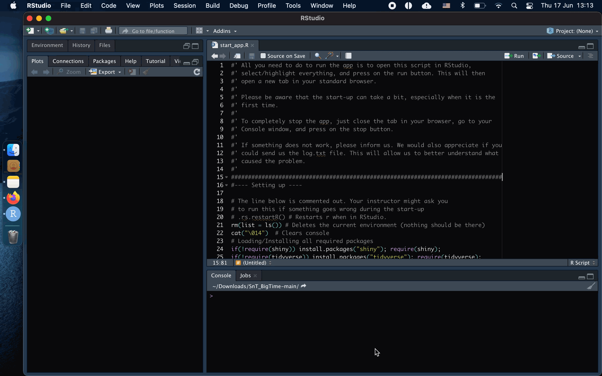

# A non-technical, interactive introduction to Vector AutoRegressive (VAR) models

## Purpose

The purpose of this interactive notebook is to provide a non-technical introduction to the R-lirbary *bigtime* as well as high-dimensional VAR models. 

Vector AutoRegressive (VAR) models are often used in macroeconomics and finance. Although VAR models allow to model a large number of variables at the same time, they quickly become high-dimensional or even infeasible to be estimated using traditional techniques. This puts limitations on their usefulness, as one would usually like to model a rather large number of series together (1) to take into account all information, and (2) because it is often unreasonable to assume that variables are exogenous - at least in finance and macroeconomics. Moreover, modelling time series together can often lead to new insights and better forecasts.

This repository contains an interactive notebook explaining the R-library `bigtime` whose' goal it is to solve the problems traditional techniques have when estimating high-dimensional VAR models. The notebook is written for a wide audience and assumes only basic knowledge of VAR models, which can also be obtained by reading this [notebook](https://github.com/enweg/SnT_VARS).

> *bigtime* can be found on CRAN and on [Github](https://github.com/ineswilms/bigtime)
> This work was done during my student assistantship under Ines Wilms and was supported through the Elinor Ostrom Grant.

## Using the Notebook

The interactive notebook can be used in various forms. The easiest is to open the notebook on mybinder.org. This can be done by using the following link.

> Please be aware that the loading process can take a while. By clicking on the *show* button, you can see what is going on.

1. Notebook: 

The second way to use the notebook is to download the repository and to start the notebook locally. This is also the only option that does not require any internet connection. Since this is the more complicated way, below is a more detailed description on how this can be done:

1. Download the repository

2. Open the *start_app.R* script in RStudio

4. Highlight everything and press *run*

## Problems, Suggestions, and Corrections

If you encounter any problems, have any suggestions, or found a mistake that should be corrected, please open an issue here on Github and let us know about it. We appreciate any feedback!

